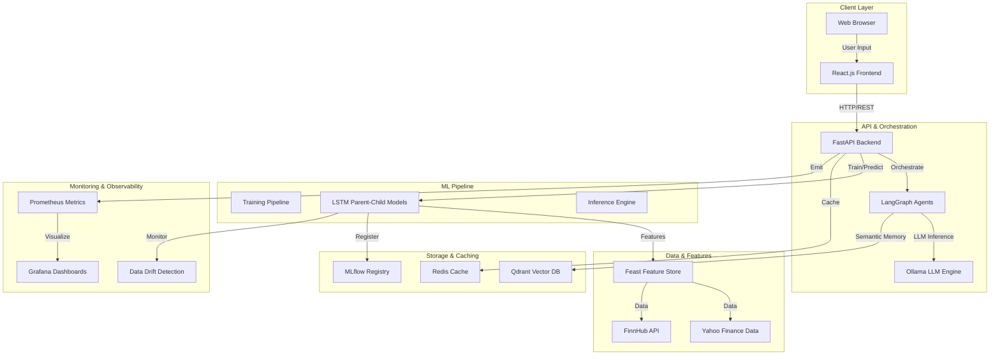

# MLOps Stock Classification Pipeline

[](LICENSE)
[](https://www.python.org/downloads/)
[](https://react.dev/)
[](https://www.typescriptlang.org/)
[](https://docs.docker.com/compose/)
[](https://kubernetes.io/)

> **Production-ready MLOps system for institutional-grade stock market analysis using Transfer Learning (LSTM), LangGraph AI agents, and a modern React.js frontend.**

**Developed by** [Mujtaba Junaid](https://github.com/MujtabaJunaid)

**[Repository])**: [This Repo's URL](https://github.com/MujtabaJunaid/stock-agent-classifier) 

---

## System Architecture



---

## Overview

This project is a **production-grade MLOps pipeline** that automates the complete lifecycle of stock price prediction and financial analysis. It combines cutting-edge machine learning with modern infrastructure practices.

### Key Capabilities

- **Transfer Learning Architecture**: Parent-Child model strategy trained on S&P 500 composite, then fine-tuned per ticker with minimal data overhead.
- **Multi-Agent AI System**: LangGraph-powered agents (Financial Analyst, Market Expert, Data Validator, Report Generator) orchestrate institutional-grade analysis.
- **Modern React Frontend**: Beautiful, responsive UI built with React 18, TypeScript, Tailwind CSS, and Recharts for real-time data visualization.
- **Real-time Inference**: Low-latency predictions with Redis caching (1-day TTL) and optimized serving pipeline.
- **Feast Feature Store**: Consistent, versioned features for training and serving environments.
- **Full Observability**: Prometheus + Grafana monitoring, Evidently AI drift detection, and comprehensive logging.
- **MLflow Experiment Tracking**: Full experiment registry, model versioning, and DagsHub remote tracking.
- **Cloud-Ready Infrastructure**: Docker Compose for local development, Kubernetes manifests for production deployment.

---

## Tech Stack

| Layer | Technology |
| :--- | :--- |
| **Frontend** | React 18, TypeScript, Vite, Tailwind CSS, Recharts |
| **Backend API** | FastAPI, Uvicorn, Async/Await |
| **Model Training** | PyTorch, LSTM, Transfer Learning |
| **ML Orchestration** | LangGraph, LangChain, Ollama |
| **LLM & Embeddings** | Ollama (`gpt-oss:20b-cloud`, `nomic-embed-text`) |
| **Feature Management** | Feast Feature Store |
| **Vector Database** | Qdrant (Semantic Caching, RAG) |
| **Cache Layer** | Redis Stack |
| **Experiment Tracking** | MLflow + DagsHub |
| **Observability** | Prometheus, Grafana, Evidently AI |
| **Infrastructure** | Docker Compose, Kubernetes, Helm-ready |
| **Language** | Python 3.11+, TypeScript 5+ |

---

## Quick Start

### Prerequisites

1. **System Requirements**
   - Docker & Docker Compose (or Kubernetes cluster)
   - 16GB+ RAM, 50GB+ disk space
   - Python 3.11+ (for local development)
   - Node.js 18+ (for frontend development)

2. **External Dependencies**
   - [Ollama](https://ollama.com/) running locally (port 11434)
   - [FinnHub API Key](https://finnhub.io/) (free tier available)
   - [DagsHub Account](https://dagshub.com/) (optional, for remote MLflow tracking)

### Step 1: Clone Repository

```bash
git clone https://github.com/MujtabaJunaid/stock-agent-classifier.git
cd stock-agent-classifier
```

### Step 2: Configure Environment

Create `.env` file in project root:

```bash
# ============= MLOps Tracking =============
DAGSHUB_USER_NAME=your_dagshub_username
DAGSHUB_REPO_NAME=stock-agent-classifier
DAGSHUB_TOKEN=your_dagshub_token
MLFLOW_TRACKING_URI=https://dagshub.com/your_username/stock-agent-classifier/mlflow

# ============= External APIs =============
GOOGLE_API_KEY=your_google_api_key
FMI_API_KEY=your_finnhub_api_key

# ============= Infrastructure =============
REDIS_HOST=redis
REDIS_PORT=6379
QDRANT_API_KEY=mujtaba-secure-key

# ============= Ownership =============
SERVICE_OWNER=mujtaba-junaid-ops
ENVIRONMENT=production
```

### Step 3: Spin Up Services

#### Option A: Docker Compose (Recommended for Local Dev)

```bash
# Build and start all services
docker-compose up --build -d

# View logs
docker-compose logs -f fastapi

# Stop services
docker-compose down
```

#### Option B: Kubernetes (Production)

```bash
# Create namespace and deploy
kubectl apply -f k8s/

# Port-forward for local access
kubectl port-forward -n mujtaba-mlops svc/fastapi-service 8000:8000 &
kubectl port-forward -n mujtaba-mlops svc/frontend-service 5173:5173 &

# Monitor deployment
kubectl get pods -n mujtaba-mlops -w
```

### Step 4: Download Ollama Models

```bash
# Terminal 1: Start Ollama service
ollama serve

# Terminal 2: Pull required models
ollama pull gpt-oss:20b-cloud
ollama pull nomic-embed-text

# Verify models are loaded
ollama list
```

### Step 5: Access Applications

| Application | URL | Credentials |
| :--- | :--- | :--- |
| **React Frontend** | http://localhost:5173 | N/A |
| **FastAPI Docs** | http://localhost:8000/docs | N/A |
| **Grafana Dashboard** | http://localhost:3000 | admin/mujtaba-admin-secure |
| **Prometheus Metrics** | http://localhost:9090 | N/A |
| **Redis Stack UI** | http://localhost:8001 | N/A |
| **Qdrant Console** | http://localhost:6333/dashboard | N/A |

---

## Workflow & Features

### 1. Stock Analysis Pipeline

```
User Input (Ticker) 
    ↓
React Frontend Validation
    ↓
FastAPI /analyze Endpoint
    ↓
LangGraph Agent Orchestration
    ├─→ Financial Analyst Agent (Context retrieval)
    ├─→ Market Expert Agent (Technical analysis)
    ├─→ Data Validator Agent (Quality checks)
    └─→ Report Generator Agent (Synthesis)
    ↓
LSTM Inference (Parent → Child Transfer Learning)
    ├─→ Check Redis cache (1-day TTL)
    ├─→ If miss: Run prediction
    └─→ Store in Qdrant vector DB
    ↓
AI-Generated Report + Price Forecast
    ↓
React Frontend Visualization (Recharts)
```

### 2. Parent-Child Transfer Learning

```
S&P 500 Historical Data (Yahoo Finance)
    ↓
Parent LSTM Training (Weekly sync)
    └─→ Base model for all tickers
    
Individual Ticker Data (FinnHub)
    ↓
Child Model Fine-tuning (On-demand)
    ├─→ Load parent weights
    ├─→ Adapt to ticker-specific patterns
    └─→ Store in /outputs/{ticker}/
    
New Prediction Request
    ↓
Load child model + Inference
    ├─→ 30-day rolling forecast
    ├─→ Confidence intervals
    └─→ Return to frontend
```

### 3. Monitoring & Drift Detection

```
Live Predictions
    ↓
Prometheus Scrape (/metrics endpoint)
    ├─→ Prediction latency
    ├─→ Cache hit/miss ratio
    ├─→ Model invocation count
    └─→ Error rates
    
Evidently AI Data Drift Monitor
    ├─→ Feature distribution shift
    ├─→ Target variable drift
    └─→ Out-of-range alerts
    
Grafana Dashboards
    └─→ Real-time visualization + alerting
```

---

## API Documentation

### Core Endpoints

#### **GET /health**
System health check.
```bash
curl http://localhost:8000/health
```

**Response:**
```json
{"status": "healthy"}
```

---

#### **POST /analyze**
Analyze a stock and generate AI-powered report.

**Request:**
```bash
curl -X POST http://localhost:8000/analyze \
  -H "Content-Type: application/json" \
  -d '{"ticker": "NVDA", "thread_id": "session-123"}'
```

**Response:**
```json
{
  "task_id": "analyze-nvda-1710346800",
  "status": "completed",
  "prediction": {
    "forecast": [
      {"date": "2025-03-16", "close": 875.42},
      {"date": "2025-03-17", "close": 876.10}
    ],
    "history": [
      {"date": "2025-03-15", "close": 874.50}
    ]
  },
  "analysis": {
    "sentiment": "bullish",
    "recommendation": "buy",
    "report": "NVDA shows strong momentum with AI chip demand..."
  }
}
```

---

#### **POST /train-parent**
Initiate parent model training (S&P 500).

```bash
curl -X POST http://localhost:8000/train-parent
```

---

#### **POST /predict-child**
Get prediction for specific ticker.

```bash
curl -X POST http://localhost:8000/predict-child \
  -H "Content-Type: application/json" \
  -d '{"ticker": "AAPL"}'
```

---

#### **GET /metrics**
Prometheus metrics in OpenMetrics format.

```bash
curl http://localhost:8000/metrics
```

---

#### **GET /system/cache**
Inspect Redis cache statistics.

```bash
curl http://localhost:8000/system/cache
```

---

#### **GET /monitor/{ticker}**
Get monitoring data for specific ticker.

```bash
curl http://localhost:8000/monitor/NVDA
```

---

## Development

### Local Setup (Without Docker)

```bash
# 1. Create virtual environment
python -m venv venv
source venv/bin/activate  # On Windows: venv\Scripts\activate

# 2. Install dependencies
pip install -r requirements.txt
pip install -r backend/requirements.txt

# 3. Start backend locally
python main.py  # Starts on http://localhost:8000

# 4. In another terminal: Start frontend
cd frontend
npm install
npm run dev  # Starts on http://localhost:5173
```

### Running Tests

```bash
# Backend tests
pytest tests/ -v --cov=src

# Frontend tests
cd frontend && npm run test
```

### Code Quality

```bash
# Backend linting
black src/ backend/
flake8 src/ backend/
mypy src/ backend/

# Frontend linting
cd frontend && npm run lint
```

---

## Deployment

### Local with Docker Compose

```bash
# Build images
docker-compose build

# Start services
docker-compose up -d

# Check status
docker-compose ps

# View logs
docker-compose logs -f fastapi

# Stop everything
docker-compose down -v  # Use -v to remove volumes
```

### Production on Kubernetes

```bash
# Create namespace
kubectl create namespace mujtaba-mlops

# Deploy all services
kubectl apply -f k8s/

# Verify deployments
kubectl get deployments -n mujtaba-mlops

# Check pod status
kubectl get pods -n mujtaba-mlops

# View service endpoints
kubectl get svc -n mujtaba-mlops

# Scale services
kubectl scale deployment fastapi-backend -n mujtaba-mlops --replicas=5

# Check pod logs
kubectl logs -n mujtaba-mlops deployment/fastapi-backend -f
```

### Monitoring Deployed System

```bash
# Port-forward to Grafana
kubectl port-forward -n mujtaba-mlops svc/grafana 3000:3000

# Access at http://localhost:3000
# Username: admin
# Password: mujtaba-admin-secure
```

---

## 🔐 Security Best Practices

1. **Secrets Management**
   - Use Kubernetes Secrets for API keys
   - Store `.env` securely (never commit)
   - Rotate credentials regularly

2. **Network Security**
   - Use TLS/HTTPS in production
   - Configure network policies in K8s
   - Rate limiting on FastAPI endpoints

3. **Data Protection**
   - Encrypt data at rest (volumes)
   - Encrypt data in transit (TLS)
   - Audit logging for sensitive operations

---

## System Performance

### Benchmarks (On 4-core / 8GB RAM)

| Operation | Latency | Throughput |
| :--- | :--- | :--- |
| Cache Hit Prediction | 50-100ms | 1000+ req/s |
| Cache Miss Prediction | 500-2000ms | 10-50 req/s |
| Parent Training | ~5 mins | N/A |
| Child Training | ~2 mins | N/A |
| Agent Report Generation | 3-10 secs | N/A |

---

## Contributing

Contributions are welcome! Please:

1. Fork the repository
2. Create feature branch: `git checkout -b feature/your-feature`
3. Commit changes: `git commit -m "Add feature description"`
4. Push to branch: `git push origin feature/your-feature`
5. Open Pull Request

---

## License

This project is licensed under the MIT License—see [LICENSE](LICENSE) file for details.

---

## Support & Contact

- **GitHub**: https://github.com/MujtabaJunaid
- **Email**: mujtabajunaid@github.com
- **Issues**: Report bugs or feature requests via GitHub Issues

---

## Acknowledgments

- **Ollama** for open-source LLM inference
- **LangGraph** for AI agent orchestration
- **Feast** for feature store management
- **Qdrant** for vector search capabilities
- **FastAPI** for production-ready backend framework
- **React** for modern frontend development

---

**Built with passion by Mujtaba Junaid**  
*Last Updated: March 2025*
